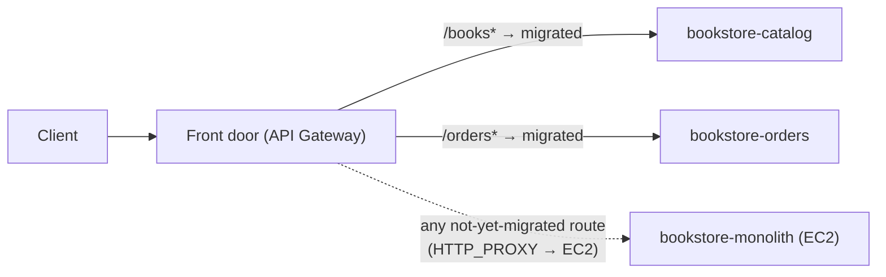

# Step 6 — HTTP API Front Door + Strangler Cutover

This is the heart of the migration. You'll put **one front door** in front of both worlds and
move traffic **route by route** from the monolith to the serverless slices — the **Strangler
Fig pattern**. Nobody flips a single switch that swaps the whole app; you migrate `/books*`
first, watch it, then `/orders*`, and the monolith quietly stops mattering.

---

## 6.1 The Strangler Fig idea

A strangler fig grows around a host tree, takes over its structure, and eventually the host
rots away leaving the fig standing. In software: build the new system **around** the old one,
redirect functionality piece by piece, and retire the old system only when it serves nothing.



The front door here is **API Gateway HTTP API**. For routes you've migrated, it integrates
with a **Lambda**. For routes still on the monolith, it can use an **HTTP_PROXY** integration
that forwards to the EC2 instance — so the *client* sees one stable URL the whole time.

---

## 6.2 Create the HTTP API

1. **API Gateway → Create API → HTTP API → Build.**
2. **API name:** `bookstore-api`. **Next** through to **Create** (no integrations yet).

### Add the migrated Lambda routes

3. **Develop → Routes → Create**, add:
   | Method | Path |
   |--------|------|
   | GET | `/books` |
   | GET | `/books/{id}` |
   | POST | `/orders` |
   | GET | `/orders/{id}` |
4. **Develop → Integrations**, attach:
   - `GET /books`, `GET /books/{id}` → **Lambda** → `bookstore-catalog`
   - `POST /orders`, `GET /orders/{id}` → **Lambda** → `bookstore-orders`
5. The console auto-adds invoke permission for each function. Note the **Invoke URL**
   (`https://<api-id>.execute-api.us-east-1.amazonaws.com`).

> **Why HTTP API (not REST)?** Cheaper ($1.00 vs $3.50 / M), lower latency, and the payload
> v2.0 shape your handlers already expect. The [HTTP-API CRUD project](../../../../intermediate/aws/aws-api-gateway-dynamodb-crud/README.md)
> covers it in depth.

### CLI alternative (all four routes)

```bash
API_ID=$(aws apigatewayv2 create-api --name bookstore-api \
  --protocol-type HTTP --query ApiId --output text)
ACCOUNT_ID=$(aws sts get-caller-identity --query Account --output text)

CAT_ARN=arn:aws:lambda:us-east-1:${ACCOUNT_ID}:function:bookstore-catalog
ORD_ARN=arn:aws:lambda:us-east-1:${ACCOUNT_ID}:function:bookstore-orders

# One integration per function, reused by that function's routes
CAT_INT=$(aws apigatewayv2 create-integration --api-id $API_ID \
  --integration-type AWS_PROXY --integration-uri $CAT_ARN \
  --payload-format-version 2.0 --query IntegrationId --output text)
ORD_INT=$(aws apigatewayv2 create-integration --api-id $API_ID \
  --integration-type AWS_PROXY --integration-uri $ORD_ARN \
  --payload-format-version 2.0 --query IntegrationId --output text)

aws apigatewayv2 create-route --api-id $API_ID --route-key 'GET /books'       --target "integrations/$CAT_INT"
aws apigatewayv2 create-route --api-id $API_ID --route-key 'GET /books/{id}'  --target "integrations/$CAT_INT"
aws apigatewayv2 create-route --api-id $API_ID --route-key 'POST /orders'     --target "integrations/$ORD_INT"
aws apigatewayv2 create-route --api-id $API_ID --route-key 'GET /orders/{id}' --target "integrations/$ORD_INT"

# Let API Gateway invoke each function. The trailing * covers BOTH /books and
# /books/{id} — without it, the single-book route gets a 500 "not authorized".
aws lambda add-permission --function-name bookstore-catalog \
  --statement-id apigw-catalog --action lambda:InvokeFunction \
  --principal apigateway.amazonaws.com \
  --source-arn "arn:aws:execute-api:us-east-1:${ACCOUNT_ID}:${API_ID}/*/*/books*"
aws lambda add-permission --function-name bookstore-orders \
  --statement-id apigw-orders --action lambda:InvokeFunction \
  --principal apigateway.amazonaws.com \
  --source-arn "arn:aws:execute-api:us-east-1:${ACCOUNT_ID}:${API_ID}/*/*/orders*"
```

#### ⚠️ If you built the API by CLI, you must create the stage yourself

This is the single most common way to get stuck in this step. When you create an HTTP API in
the **Console**, it quietly creates a `$default` stage for you and auto-deploys to it. When you
create one with `create-api` on the **CLI**, it does **not** — you get an API with perfectly
good routes and nowhere to serve them from. Every request then returns:

```json
{"message":"Not Found"}
```

…which looks exactly like a broken route, so people go back and rebuild their routes over and
over. Check first, then create the stage:

```bash
aws apigatewayv2 get-stages --api-id $API_ID --query "Items[].StageName"
# []  <- empty means this is your problem

aws apigatewayv2 create-stage --api-id $API_ID \
  --stage-name '$default' --auto-deploy
```

`--auto-deploy` is what gives you the "no separate deploy step" behaviour: from then on, every
route or integration change goes live on its own. Quote `'$default'` so your shell doesn't try
to expand `$default` as a variable and hand the CLI an empty string.

Now grab the invoke URL:

```bash
BASE="https://${API_ID}.execute-api.us-east-1.amazonaws.com"
curl $BASE/books
```

---

## 6.3 Cut over route-by-route (the migration)

Do this **deliberately**, one domain at a time, verifying between moves. That discipline is
the whole point — it's how you'd do it in production where a bad route means real lost orders.

**Vine 1 — migrate `/books*`:**

```bash
BASE=https://<api-id>.execute-api.us-east-1.amazonaws.com
curl $BASE/books          # served by bookstore-catalog now
```

Watch `bookstore-catalog`'s CloudWatch metrics (Invocations, Errors) for a few minutes. Happy?
`/books*` is migrated. The monolith still serves nothing-but-orders.

**Vine 2 — migrate `/orders*`:**

```bash
curl -X POST $BASE/orders -H 'content-type: application/json' \
  -d '{"book_id":"<real-id>","qty":1}'
curl $BASE/orders/<order-id>
```

Now both domains are served by serverless. The EC2 monolith is receiving **zero** traffic
through the front door.

#### Optional — keep the monolith reachable during the window

This is what makes a real, gradual strangler possible: add a catch-all route with an
**HTTP_PROXY** integration pointing at the EC2 box. Any route you *haven't* migrated yet still
works through the same front-door URL, and you delete the catch-all once everything's moved.

```bash
PROXY_INT=$(aws apigatewayv2 create-integration --api-id $API_ID \
  --integration-type HTTP_PROXY --integration-method ANY \
  --integration-uri "http://<ec2-ip>:5000/{proxy}" \
  --payload-format-version 1.0 --query IntegrationId --output text)
aws apigatewayv2 create-route --api-id $API_ID \
  --route-key 'ANY /{proxy+}' --target "integrations/$PROXY_INT"
```

Two things trip people up here:

- **`--integration-method` is required** for `HTTP_PROXY` (it's optional for Lambda), and
  HTTP_PROXY integrations use **payload format 1.0**, not the 2.0 your Lambdas use.
- **Your security group must let API Gateway in.** In Step 1 you opened port 5000 to *your own
  IP only*. API Gateway calls your instance from AWS's network, not from your laptop, so the
  connection is refused and every catch-all request returns `503 Service Unavailable`. API
  Gateway does **not** publish a fixed IP range for HTTP_PROXY egress, so there is no narrow
  CIDR you can allow.

> **Security note.** Making this work means opening port 5000 much more widely than "My IP" —
> effectively to the internet — on a box serving a plaintext HTTP app with no auth. That is
> fine for a throwaway lab instance you terminate in Step 7, and **not** something to imitate
> in production. The production-safe shape is a **VPC Link** (private integration to an ALB or
> NLB inside your VPC), so the monolith never needs a public listener at all. If you'd rather
> not open the port, skip this optional catch-all: the four explicit routes above are enough to
> complete the migration, and you can still reach the monolith directly from your own IP.

**Explicit routes always win.** Once the catch-all exists, you might worry it will swallow
`/books`. It won't — API Gateway prefers the most specific match, so `GET /books` goes to
Lambda while `GET /health` (which has no explicit route) falls through to the monolith. That's
precisely the property that lets you migrate one route at a time.

When every route is migrated, delete the catch-all rather than fixing it — that deletion *is*
the cutover completing:

```bash
RID=$(aws apigatewayv2 get-routes --api-id $API_ID \
  --query "Items[?RouteKey=='ANY /{proxy+}'].RouteId" --output text)
aws apigatewayv2 delete-route --api-id $API_ID --route-id $RID
```

---

## 6.4 Verify parity

Run the same requests against the **old** monolith URL and the **new** API URL and confirm the
responses match. Parity is your signal that it's safe to retire the host tree.

| Check | Monolith `http://<ip>:5000` | API `https://<api-id>...` |
|-------|------------------------------|----------------------------|
| `GET /books` | 3 books | same 3 books |
| `GET /books/{id}` (bad id) | 404 | 404 |
| `POST /orders` (valid) | 201 + id | 201 + id |
| `POST /orders` (bad id) | 400 | 400 |
| `GET /orders/{id}` (bad id) | 404 | 404 |

**Don't just eyeball the status codes — compare the bodies.** Status-code parity is easy; it's
the *shape* of the JSON that silently breaks clients. Let the machine check it:

```bash
python3 - <<'EOF'
import json, urllib.request
mono = json.load(urllib.request.urlopen("http://<ec2-ip>:5000/books/<book-id>"))
api  = json.load(urllib.request.urlopen("https://<api-id>.execute-api.us-east-1.amazonaws.com/books/<book-id>"))
print("monolith:", mono)
print("api     :", api)
print("identical:", mono == api)
EOF
```

You want `identical: True`. The classic way this fails is **numbers coming back as strings** —
`"price": "39.99"` instead of `"price": 39.99`. DynamoDB hands numbers to Python as `Decimal`,
which `json.dumps` can't serialise, so the lazy fix (`default=str`) turns every number into a
string and quietly breaks the contract. The handlers in `src/` avoid this with a small
`_json_default` that converts `Decimal` back to `int`/`float`; see the troubleshooting entry
**"`price` comes back as a string"** if you hit it in your own code.

> **Why this matters more than it looks.** "Backward compatibility during migration" is the
> principle that lets the front door switch traffic safely. If the new slice returns a
> different *type*, a client doing `price * qty` starts throwing — and it'll happen in
> production, after cutover, not here.

---

## Checkpoint

- [ ] `bookstore-api` routes all four endpoints to the right Lambda
- [ ] `/books*` and `/orders*` both work through the API URL
- [ ] Responses match the monolith's (parity confirmed)
- [ ] The monolith is receiving no traffic via the front door
- [ ] You can explain the strangler fig pattern in one sentence

---

**Next:** [Step 7 — Decommission the Monolith](./07-decommission-monolith.md)
